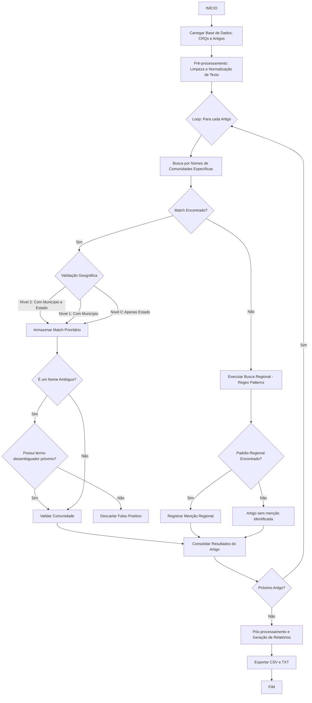

# DandaraData: Identificação de Comunidades Remanescentes de Quilombos na Produção Científica

> Uma ferramenta de mineração de texto e bibliometria desenvolvida para identificar, mapear e analisar a visibilidade de Comunidades Remanescentes de Quilombos (CRQs) em grandes volumes de artigos científicos.


---

## 📖 Sobre o Projeto

O **DandaraData** é um programa desenvolvido no contexto do **MensureLab - Laboratório de Estudos Métricos da Informação e de Avaliação de Políticas Públicas em CTI para o desenvolvimento da Amazônia Legal (UFPA)**, criado para superar o desafio metodológico da identificação manual de entidades geográficas em grandes *corpora* de texto.

O nome do programa é uma homenagem a **Dandara**, do Quilombo dos Palmares, símbolo de resistência ao sistema escravista.

### Objetivo
Automatizar o cruzamento de dados entre a produção científica (indexada na SciELO) e a lista oficial de CRQs certificadas pela Fundação Cultural Palmares (FCP). O objetivo é responder a questões sobre assimetrias regionais e visibilidade científica destas comunidades.

---

## ⚙️ Como Funciona (Metodologia)

O algoritmo opera sob uma lógica **determinística**, utilizando expressões regulares (*Regex*) e regras de validação estritas para garantir alta precisão (minimizar falsos positivos).

O processamento ocorre em três etapas principais de filtragem:

### 1. Detecção e Priorização Geográfica
O sistema cruza os termos encontrados nos metadados dos artigos (Título, Resumo, Palavras-chave) com a base de dados da FCP. Para resolver problemas de homonímia (comunidades com mesmo nome em locais diferentes), aplica-se uma hierarquia de evidência:
* **Nível 2 (Alta Prioridade):** Encontra `Nome da Comunidade` + `Município` + `Estado`.
* **Nível 1 (Média Prioridade):** Encontra `Nome da Comunidade` + `Município`.
* **Nível 0 (Baixa Prioridade):** Encontra `Nome da Comunidade` + `Estado`.

### 2. Validação Semântica e Desambiguação
Para nomes de comunidades que são palavras comuns (ex: "Barreiras", "Solidão", "União"), o DandaraData exige um **contexto desambiguador**.
* *Exemplo:* A palavra "Forte" só será considerada uma comunidade se for precedida (janela de 4 palavras) por termos como "Quilombo", "Comunidade", "Território", etc.

### 3. Busca Regional
Caso não encontre uma comunidade específica, o algoritmo busca por menções generalistas através de padrões linguísticos.
* *Exemplo:* Identifica frases como *"comunidades quilombolas do sertão da Bahia"* ou *"quilombos da região norte"*.

---

## 🔄 Fluxograma de Execução

O diagrama abaixo ilustra o fluxo lógico implementado:



---

## 💻 Requisitos Técnicos

Para executar o DandaraData, você precisará de:

* **Python 3.7+**
* Biblioteca **Pandas**

### Instalação das Dependências

Execute o comando abaixo no seu terminal para instalar as bibliotecas necessárias:

```bash
pip install pandas

```

*Nota: As bibliotecas `re`, `unicodedata`, `collections`, `sys`, `io` e `csv` são nativas do Python e não requerem instalação.*

---

## Como Usar

### 1. Preparação dos Arquivos

O script espera dois arquivos CSV na mesma pasta (ou no Google Drive, se usar Colab), formatados com separador **ponto e vírgula (;)**:

1. **`crqs_atual.csv`**: Lista de comunidades. Deve conter colunas para ID, Região, UF, Município e Nome da Comunidade.
2. **`artigos_atual.csv`**: Base de artigos. Deve conter colunas normalizadas para Título, Resumo, Palavras-chave e Instituição.

### 2. Execução

Você pode rodar o script localmente ou no Google Colab.

**Opção A: Localmente (Terminal)**

```bash
python dandara_data.py

```

**Opção B: Google Colab**
O script possui detecção automática de ambiente. Se rodar no Colab, ele tentará montar o Google Drive e buscar os arquivos no caminho:
`/content/drive/My Drive/estudo_quilombos_organizado/`

Pode-se criar essa pasta no google drive ou mudar no código esse trecho para outro nome.
### 3. Resultados (Outputs)

Após a execução, o programa gerará três arquivos:

| Arquivo | Descrição |
| --- | --- |
| **`resultados.txt`** | Relatório em texto legível listando cada correspondência ("A comunidade X foi citada no artigo Y"). |
| **`resultados_detalhados.csv`** | Tabela completa relacionando Comunidade, Localização e Metadados do Artigo. Ideal para análise estatística. |
| **`artigos_final.csv`** | Cópia da base de artigos original, enriquecida com colunas indicando qual comunidade ou região foi identificada em cada linha. |

---

##  Estrutura do Código

* **`class Community`**: Representa uma CRQ com atributos de localização e normalização de nomes.
* **`class Article`**: Gerencia os metadados do artigo e cria índices de termos (`terms_dict`) para busca ultra-rápida.
* **`class RegionalMatch`**: Estrutura para armazenar menções generalistas (ex: "Quilombos do Pará").
* **`class QuilombolaAnalyzer`**: O núcleo do sistema. Contém:
* Listas de exclusão e termos ambíguos.
* Regex para padrões regionais.
* Lógica de hierarquia (Município vs Estado).
* Gerador de relatórios.


---

## 👥 Autores e Créditos

Desenvolvido pelo **MensureLab** (UFPA).

* **Autores da pesquisa:** Ramiro Arthur Sobrinho Freire Silva, Josafha Pereira de Carvalho e Ediane Maria Gheno.
* **Desenvolvedores do Código:** @RamiroKord & @Josafha-pereira, orientados por Ediane Maria Gheno.

---

```

```